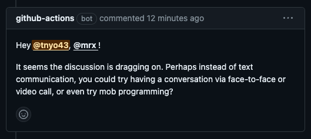

# recommend-mobpro-action

This is a GitHub Action that recommend developers to do mob programming or video chat rather than text chat if a discussion drags on.



# usage

Create a new workflow under `.github/workflows`

```yml
name: 'recommend mobpro'
on:
  pull_request_review_comment:
    types: [created]
  issue_comment:
    types: [created]

concurrency:
  group: ${{ github.workflow }}-${{ github.ref }}
  cancel-in-progress: true

jobs:
  recommend-mobpro:
    runs-on: ubuntu-latest
    permissions:
      pull-requests: write
    steps:
      - uses: tnyo43/recommend-mobpro-action@v1
        with:
          threshold: 15 # customize this value as you like
```

## options

### threshold

A threshold at which a message is sent when the number of comments exceeds this.
(default: `25`)
